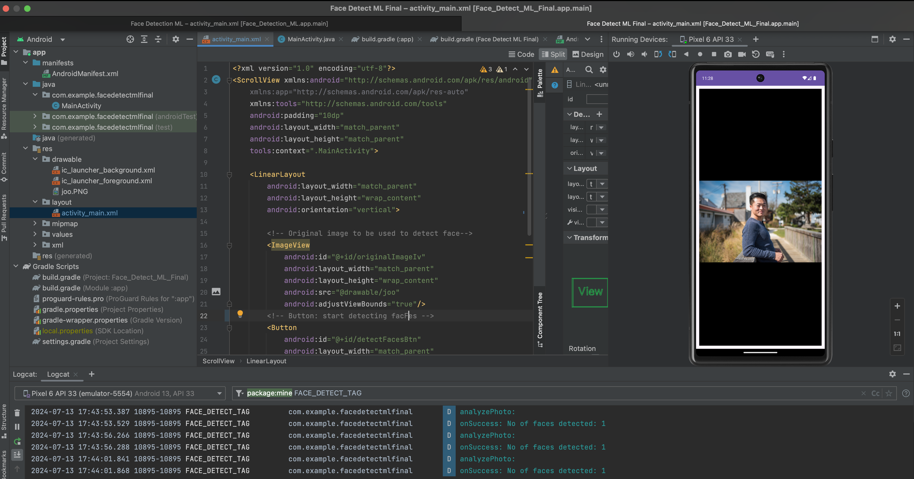

# Face-Detect-ML-App
I created an Android Studio application in Java that integrates Google and Firebase Machine Learning to detect the presence of one or more faces in an image. The user clicks on the 'Detect Face' button to generate a series of log messages in LogCat that list the number of face(s) detected. Please see the log messages in the image below!!!

